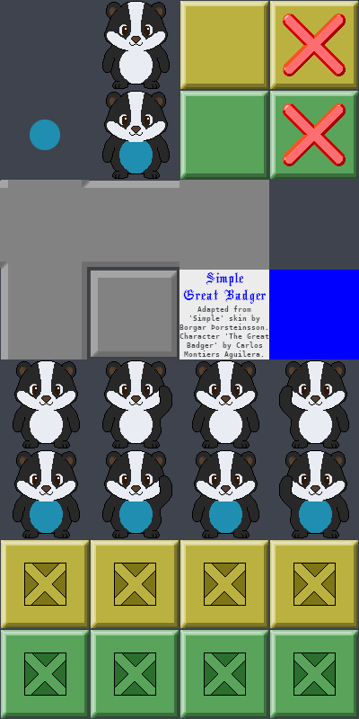
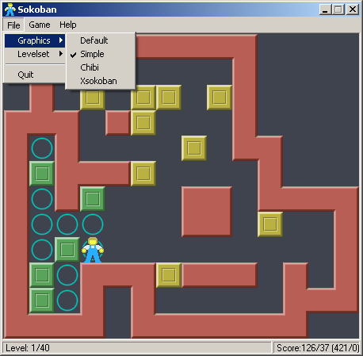
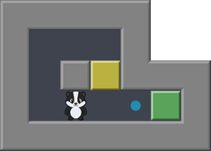

# Sokoban skin Simple Great Badger

A spritesheet designed for Sokoban games.

## Details

- **Author 1:** Borgar Þorsteinsson
- **Author 2:** Carlos Montiers Aguilera
- **Creation Date:** July 20, 2026
- **License:** CC BY-SA 4.0

## Lead

I created this Sokoban skin from scratch, adapting the 'Simple' skin created by Borgar Þorsteinsson, as shown in his original freeware program from 2003.

In 2011, the original skin was updated to lighter colors and [released](https://github.com/borgar/sokoban-skins) under Creative Commons Attribution 3.0, a license that permitted further modifications, such as reverting to darker tones.

Simple Great Badger skin example:

I made the boxes look less fat by reducing the edge width. I reused the original walls but repainted them in a simpler style to reduce brightness. The reason for changing the wall color is to reduce the visual fatigue caused by red. The light gray walls were chosen to soften the visual impact.

I added the [Great Badger character](https://github.com/carlos-montiers/sokoban-great-badger), which was designed specifically to work on dark gray backgrounds.

The skin uses the exact colors for the boxes and floor from the original skin in the 2003 program.

## License

This work is licensed under the Creative Commons Attribution-ShareAlike 4.0 International License:
https://creativecommons.org/licenses/by-sa/4.0/
